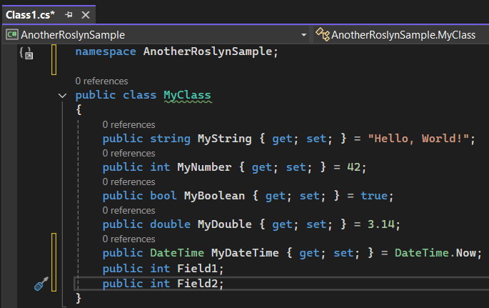
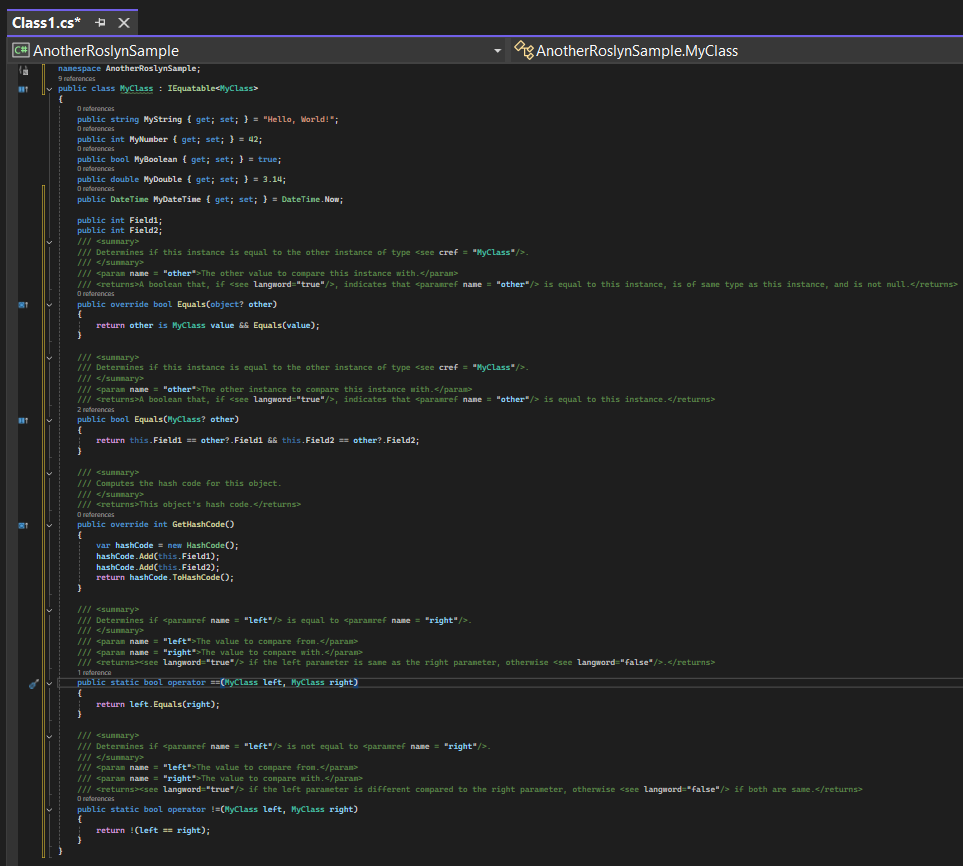
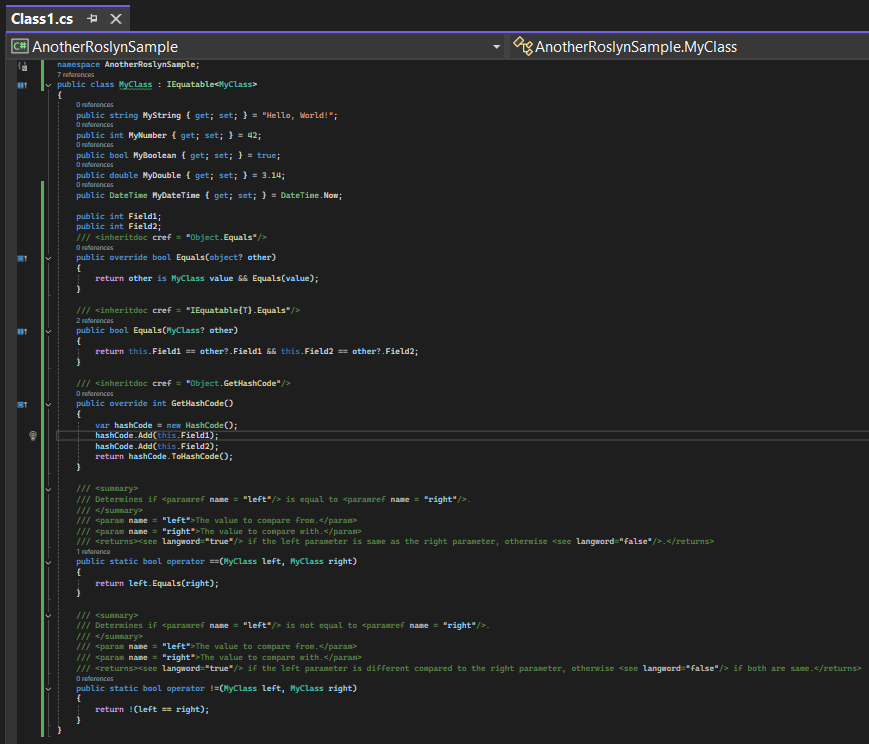

**Table of Contents**
1. [Installation](#installation)
    - 1.1. [Via Visual Studio Marketplace](#install-vsm)
    - 1.2. [Via GitHub](#install-gh)
2. [Usage](#usage)
    - 2.1. [Initial Code](#code-init)
    - 2.2. [Code after clicking to generate equality methods for fields with XML documentation](#code-eq-fields-xml)
    - 2.3. [Code after clicking to generate equality methods for fields with XML documentation, using inheritdoc where possible](#code-eq-fields-xml-inheritdoc)

# 1. Installation
This clause describes how to install AddWithXmlDoc.

### 1.1. Via Visual Studio Marketplace
Go to https://marketplace.visualstudio.com/items?itemName=winscripter.ExtVSAddWithXmlDoc. Click the Green download button. Double click the downloaded `.vsix` file and follow the instructions.

### 1.2. Via GitHub
Go to the [Releases Page](https://github.com/winscripter/AddWithXmlDoc/releases). Click on the latest release, click on the `.vsix` file. Double click the downloaded `.vsix` file and follow the instructions.

# 2. Usage

### 2.1. Initial code
Right click on the class name, and click `Quick Actions and Refactorings`, with the light bulb to the left of it.

### 2.2. Code after clicking to generate equality methods for fields with XML documentation
We had to decrease the scaling so the image isn't too big. As you can see, lots of code was generated. That much time was saved!

### 2.3. Code after clicking to generate equality methods for fields with XML documentation, using inheritdoc where possible
We had to decrease the scaling so the image isn't too big. As you can see, lots of code was generated. That much time was saved!

